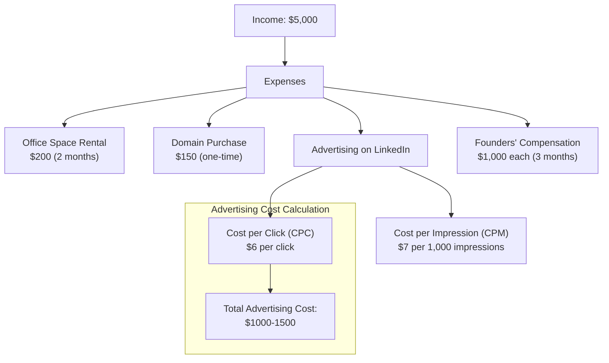

```mermaid
%% Define the chart layout
graph TD;

  %% Income node
  A[Income: $5,000]
  
  %% Expenses node
  B[Expenses]
  
  %% Office space rental
  C["Office Space Rental<br>$200 (2 months)"]
  
  %% Domain purchase
  D["Domain Purchase<br>$150 (one-time)"]
  
  %% Advertising on LinkedIn
  E[Advertising on LinkedIn]
  
  %% CPC and CPM details
  F["Cost per Click (CPC)<br>$6 per click"]
  G["Cost per Impression (CPM)<br>$7 per 1,000 impressions"]
  
  %% Founders' compensation
  H["Founders' Compensation<br>$1,000 each (3 months)"]
  
  %% Connect nodes
  A --> B
  B --> C
  B --> D
  B --> E
  E --> F
  E --> G
  B --> H

  %% Calculate total advertising cost
  subgraph Advertising Cost Calculation
    F --> TotalAdsCost["Total Advertising Cost:<br>$1000-1500"]
  end

```
