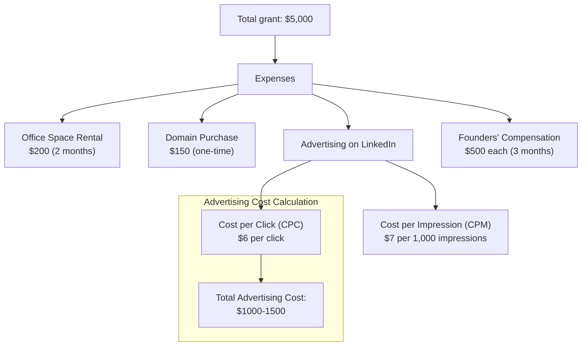
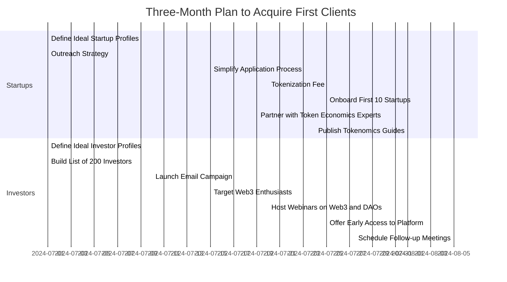
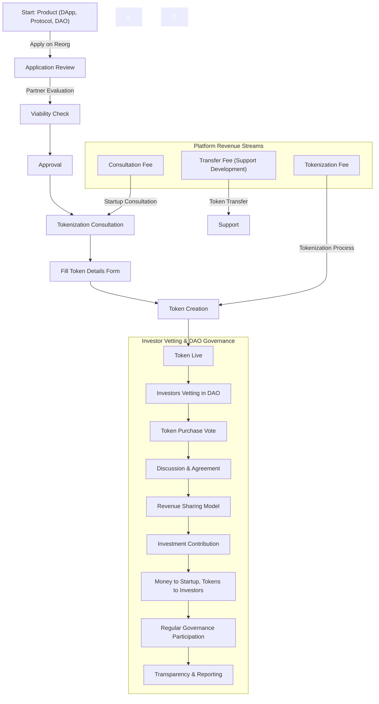

### Finance plan (3 months)

```mermaid
%% Define the chart layout
graph TD;

  %% Income node
  A[Total grant: $5,000]
  
  %% Expenses node
  B[Expenses]
  
  %% Office space rental
  C["Office Space Rental<br>$200 (2 months)"]
  
  %% Domain purchase
  D["Domain Purchase<br>$150 (one-time)"]
  
  %% Advertising on LinkedIn
  E[Advertising on LinkedIn]
  
  %% CPC and CPM details
  F["Cost per Click (CPC)<br>$6 per click"]
  G["Cost per Impression (CPM)<br>$7 per 1,000 impressions"]
  
  %% Founders' compensation
  H["Founders' Compensation<br>$500 each (3 months)"]
  
  %% Connect nodes
  A --> B
  B --> C
  B --> D
  B --> E
  E --> F
  E --> G
  B --> H

  %% Calculate total advertising cost
  subgraph Advertising Cost Calculation
    F --> TotalAdsCost["Total Advertising Cost:<br>$1000-1500"]
  end

```
### First customer acquisition plan

```mermaid
gantt
    dateFormat  YYYY-MM-DD
    title Three-Month Plan to Acquire First Clients

    section Startups
    Define Ideal Startup Profiles            :start, 2024-07-01, 30d  // Define target characteristics and needs
    Outreach Strategy                        :2024-07-01, 30d         // Develop outreach channels and messaging
    Simplify Application Process             :2024-07-15, 15d         // Streamline application and onboarding steps
    Tokenization Fee                         :2024-07-20, 10d         // Set fee structure for tokenization service
    Onboard First 10 Startups                :2024-07-25, 15d         // Process initial applications and onboard startups
    Partner with Token Economics Experts     :2024-07-30, 20d         // Collaborate with experts to refine tokenomics
    Publish Tokenomics Guides                :2024-08-01, 15d         // Release educational content on tokenomics

    section Investors
    Define Ideal Investor Profiles           :after Startups, 2024-07-01, 30d  // Specify investor criteria and preferences
    Build List of 200 Investors              :2024-07-01, 20d         // Research and compile a list of potential investors
    Launch Email Campaign                    :2024-07-10, 15d         // Initiate targeted email outreach to investors
    Target Web3 Enthusiasts                  :2024-07-15, 15d         // Focus on investors interested in Web3 technologies
    Host Webinars on Web3 and DAOs           :2024-07-20, 20d         // Conduct educational webinars on Web3 and DAOs
    Offer Early Access to Platform           :2024-07-25, 15d         // Provide exclusive access to early adopter investors
    Schedule Follow-up Meetings              :2024-08-05, 10d         // Arrange meetings to finalize investor commitments
```

#### User journey

```mermaid
graph TD;
    A["Start: Product (DApp, Protocol, DAO)"] -->|Apply on Reorg| B["Application Review"]
    B -->|Partner Evaluation| C["Viability Check"]
    C --> D["Approval"]
    D --> E["Tokenization Consultation"]
    E --> F["Fill Token Details Form"]
    F --> G["Token Creation"]
    G --> H["Token Live"]

    subgraph "Investor Vetting & DAO Governance"
        H --> I["Investors Vetting in DAO"]
        I --> J["Token Purchase Vote"]
        J --> K["Discussion & Agreement"]
        K --> L["Revenue Sharing Model"]
        L --> M["Investment Contribution"]
        M --> N["Money to Startup, Tokens to Investors"]
        N --> O["Regular Governance Participation"]
        O --> P["Transparency & Reporting"]
    end

    subgraph "Platform Revenue Streams"
        Q["Consultation Fee"]
        R["Tokenization Fee"]
        S["Transfer Fee (Support Development)"]
    end

    Q --> |Startup Consultation| E
    R --> |Tokenization Process| G
    S --> |Token Transfer| Support

    style A, B, C, D, E, F, G, H, I, J, K, L, M, N, O, P fill:#50C878,stroke:#fff,stroke-width:2px,color:#fff
    style Q, R, S fill:#50C878,stroke:#fff,stroke-width:2px,color:#fff
```
