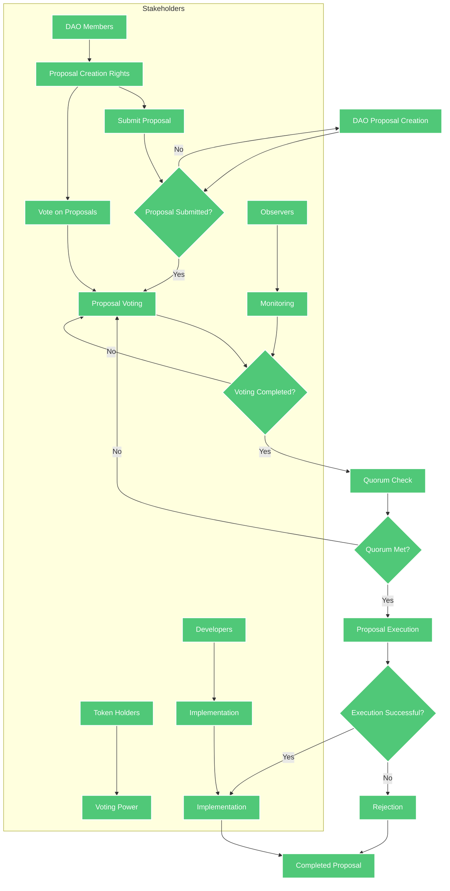
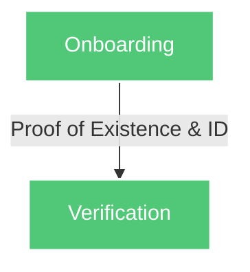
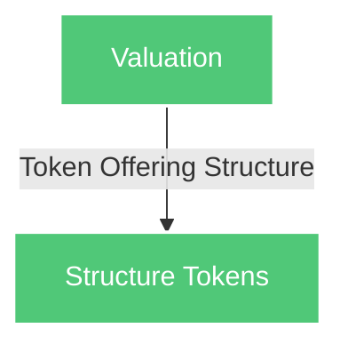
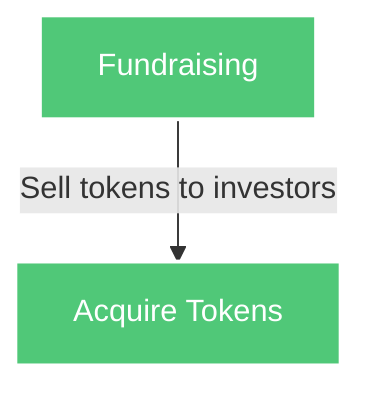
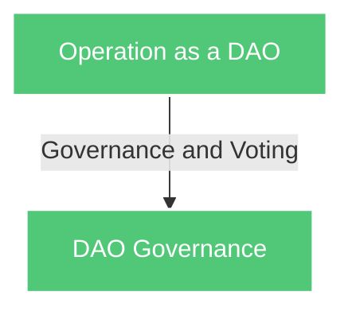
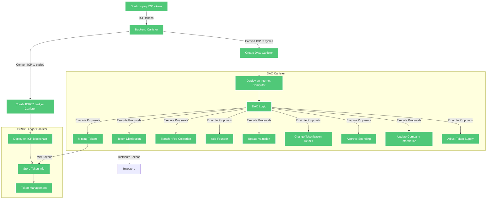

# Reorg: Transforming Startup Fundraising and Governance

## Abstract

Tokenization of assets represents the future of the global economy and ownership structures. Stablecoins serve as a successful example of asset tokenization, providing a stable digital currency backed by real-world assets. Similarly, Non-Fungible Tokens (NFTs) enable the tokenization of unique assets, creating new opportunities for ownership and investment. Jurisdictions such as Switzerland are developing legal frameworks to support the tokenization of assets, further validating this transformative approach.

Reorg leverages blockchain technology to transform startups into Decentralized Autonomous Organizations (DAOs), enabling them to tokenize their assets and governance structures. This whitepaper outlines the principles, mechanisms, and benefits of Reorg’s platform, which combines the power of fungible tokens, and DAOs to create a democratic, transparent, and efficient ecosystem for startups and investors.

## Introduction

In recent years, blockchain technology has introduced innovative ways to manage and transfer value, with tokenization gaining significant attention as the process of converting rights to an asset into a digital token on a blockchain, offering advantages like improved liquidity, enhanced security, and increased accessibility. However, traditional financing systems have shortcomings such as limited access to funding, opaque governance structures, and geographic barriers hindering global reach. Reorg addresses these challenges by democratizing access to funding through tokenization, enabling startups to raise capital directly from a global pool of investors, while providing transparent and democratic governance through tokenized DAOs, ensuring accountability and fairness in decision-making processes. Operating on the Internet Computer blockchain, Reorg transcends geographic limitations, providing a decentralized and borderless platform for startups and investors worldwide, thereby expanding investment opportunities and fostering a more inclusive global economy.

### Stablecoins as a Precedent

Stablecoins are digital currencies pegged to a stable asset, such as the US dollar or gold. They provide stability in the volatile cryptocurrency market, making them an excellent example of successful asset tokenization. By offering a stable value, stablecoins have become a popular medium of exchange and a reliable store of value.

### Tokens: The Future of Asset Ownership

In the dynamic landscape of finance, fungible tokens have emerged as a revolutionary tool for representing ownership. These tokens, built on blockchain technology, offer a seamless and transparent way to fractionalize ownership stakes in a company. By issuing fungible tokens that represent shares or ownership interests, startups can democratize access to investment opportunities, allowing individuals to easily buy and trade these tokens on cryptocurrency exchanges. This not only enhances liquidity but also fosters a global investor base, unlocking capital from a diverse range of sources. Additionally, the immutable nature of blockchain ensures secure ownership records and streamlined transfer processes, eliminating the need for intermediaries and reducing transaction costs. As a result, fungible tokens are poised to reshape the future of asset ownership, offering unparalleled efficiency, accessibility, and inclusivity in the startup ecosystem.

### Legal Frameworks for Tokenization

As the tokenization of assets gains traction, jurisdictions such as Switzerland are developing legal frameworks to support this new paradigm. These frameworks aim to provide legal clarity and protection for tokenized assets, ensuring their legitimacy and facilitating broader adoption.

## A Tokenized DAO

### What is a DAO?

A Decentralized Autonomous Organization (DAO) is an organization represented by rules encoded as a computer program that is transparent and controlled by organization members. DAOs are free from traditional centralized management and offer a democratic and transparent governance process.

### Tokenized DAO

In a tokenized DAO, ownership and governance are represented through tokens. Reorg transforms startups into DAOs, allowing them to tokenize their assets and governance structures. Startups operate on the Internet Computer blockchain, utilizing the SNS DAO framework, which is secure and thoroughly audited.

### Governance

Governance in a tokenized DAO is conducted through voting using governance tokens. Proposals can be made by any member, and the voting power is determined by the number of tokens held.




## How Reorg Works( High level overview )

### Registration to Tokenization

1. **Onboarding**

    Startups apply to Reorg and undergo proof of existence and identity verification.



2. **Valuation**

    Startups decide on their valuation metrics and structure their token offering.


3. **Tokenization**

    Ownership and assets are tokenized into ICRC1-compatible tokens. i.e they can be exchanged on decentralized exchange platforms such as ICPSWAP e.t.c

   ```mermaid
   graph TD
    E[Tokenization] -->|Fungible Tokens| F[Create Tokens]
    style E fill:#50C878,stroke:#fff,stroke-width:2px,color:#fff
    style F fill:#50C878,stroke:#fff,stroke-width:2px,color:#fff

   ```

4. #### Fundraising
    Investors can find and acquire these tokens on various exchanges, generating funding for the issuing startups




5. **Operation as DAO**

    Startups operate as DAOs with governance and decision-making through token holder voting.

6. ## How it works (Technical overview )


## Conclusion

Reorg leverages the power of blockchain and tokenization to transform the way startups raise funds and govern their operations. By creating tokenized DAOs, we enable a democratic, transparent, and efficient ecosystem for startups and investors. The use of tokens ensures liquidity, ownership clarity, and active participation in governance, driving the future of decentralized economies.

# References

1. **"The DAO" - Ethereum Whitepaper:**
   - Buterin, V. (2013). *Ethereum: A Next-Generation Smart Contract and Decentralized Application Platform*. Ethereum Whitepaper. Available at [Ethereum Whitepaper](https://ethereum.org/en/whitepaper/).

2. **Internet computer: Building a DAO:**
   - Internet computer. (n.d.). *Internet computer Documentation*. Available at [Building a DAO](https://internetcomputer.org/docs/current/references/samples/rust/basic_dao).

3. **The Bitcoin whitepaper**
    - Satoshi Nakamoto. (2008). *Bitcoin: A Peer-to-Peer Electronic Cash System*. Available at [https://bitcoin.org/bitcoin.pdf](https://bitcoin.org/bitcoin.pdf)

